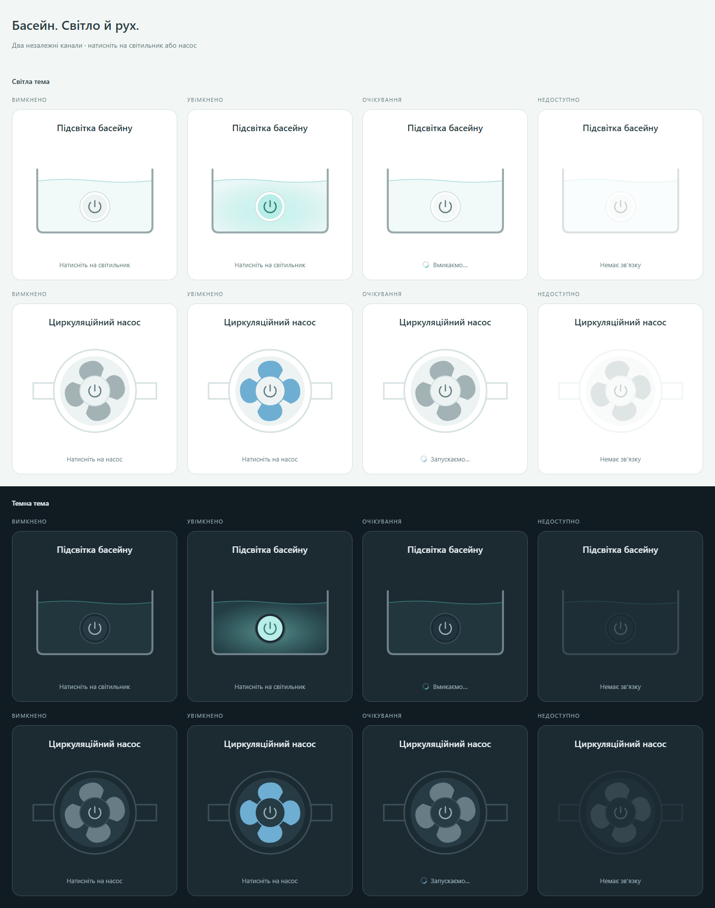

# Sonoff Pool Card

Two independent Home Assistant dashboard cards for the two switch channels of one pool relay. Each card controls exactly one configured entity. All default UI text and both visual editors are in Ukrainian.

- `custom:sonoff-pool-light-card`: a rectangular pool in side section, with a wall-mounted underwater lamp, waterline and light spreading through the water on confirmed activation.
- `custom:sonoff-pool-pump-card`: an interactive pump, with a gently accelerating and decelerating impeller.

Both are included in `sonoff-pool-card.js` and appear separately in the Home Assistant card picker. Their element and editor names are distinct from the original outdoor light card, so both projects can coexist.

## Installation

Build locally with Node.js 22.13 or later:

```sh
npm install
npm run build
npm test
```

Copy `dist/sonoff-pool-card.js` to `/config/www/sonoff-pool-card.js`, then add a dashboard resource with URL `/local/sonoff-pool-card.js` and type **JavaScript Module**. Reload the browser and select either card in the dashboard editor.

## HACS installation

1. Open HACS, then its menu → **Custom repositories**.
2. Add `https://github.com/Zoreslaw/sonoff-pool-card` with category **Dashboard**.
3. Find **Sonoff Pool Cards**, download the latest version, and reload the browser.
4. Add **Підсвітка басейну** and **Циркуляційний насос** to your dashboard and select each channel's switch entity.

If the dashboard resource was not added automatically, add `/hacsfiles/sonoff-pool-card/sonoff-pool-card.js` as a **JavaScript Module**. Use either the HACS resource or the manual `/local/` resource, not both.

Version `0.2.1` includes both cards in the single asset `sonoff-pool-card.js`. See [release notes](CHANGELOG.md).



## Configuration

Each card requires `entity`, a `switch.*` entity ID. `name` is optional and overrides the Ukrainian default title. Select a different relay channel for each card. There is no shared power control, brightness setting, or RGB setting.

```yaml
type: grid
columns: 2
square: false
cards:
  - type: custom:sonoff-pool-light-card
    entity: switch.pool_light
  - type: custom:sonoff-pool-pump-card
    entity: switch.pool_pump
```

Replace these example IDs with the switch entities from your installation. The earlier scaffold's proposed `pump_entity` and `light_entity` configuration is replaced by one `entity` per card. See [examples/card.yaml](examples/card.yaml).

## Interaction and state

Press the lamp diffuser or pump to toggle its channel. Mouse, touch, Enter and Space are supported, with visible keyboard focus. Dragging, scrolling, cancelled touches and releases outside the control do not send a command. A damped spring preserves velocity when retargeted. Pump rotation preserves its angle while slowing to a stop.

Only `hass.states` confirms on/off. `hass.callService` sends an explicit `switch.turn_on` or `switch.turn_off` to the configured entity. Pending commands block duplicates and wait up to 10 seconds for state confirmation, even after the service promise resolves. Failures and timeouts show a short retry message. Unknown, unavailable and missing entities cannot be operated. Timers, animation frames and outstanding callbacks are invalidated on removal or reconfiguration.

The turquoise light is a UI accent. Pump rotation indicates an energized relay channel, not measured water flow, pressure, power or pump health.

Home Assistant theme variables support light and dark dashboards. Reduced motion disables the spring, rotor, ripple and pulsing animations while retaining state color, pending text and a static pending indicator.

## Preview and checks

```sh
npm start
```

Open `http://localhost:5000/examples/preview.html`. The preview shows both cards off, on, pending and unavailable in both themes, with a responsive grid for wide and narrow screens. It uses simulated entities and never connects to a real relay. Pending demo tiles repeat the actual 10-second timeout cycle. Optional query parameters: `?theme=dark&state=on`.

`npm run build` runs TypeScript checking, ESLint and Rollup. `npm test` checks channel isolation, state confirmation, failures and timeout, editor integration, gesture cancellation, keyboard input, animation continuity and cleanup. Browser screenshots are in [previews](previews).

## License

MIT; see [LICENSE](LICENSE). Existing copyright notices are preserved.
